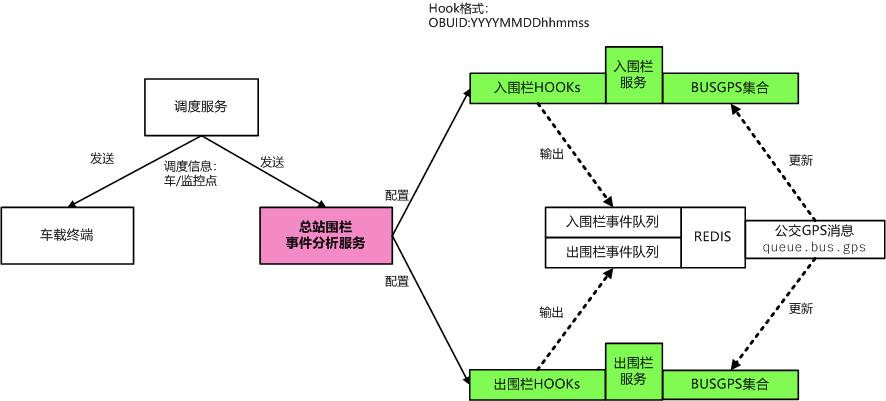

# busfenced/公交总站围栏处理

## 围栏分析架构
<p align="center" style="text-align:center;">
  
</p>

## 运行目录结构
```
/opt/busfenced
├── bin
│   ├── busfenced
│   ├── tile38-benchmark
│   ├── tile38-cli
│   └── tile38-server
├── conf
│   └── busfenced.yaml
├── log
│   └── busfenced.log
├── pid
│   ├── busfenced.pid
│   ├── tile38_7875.pid
│   └── tile38_7876.pid
└── tile38
    ├── enterfence
    │   ├── config
    │   └── queue.db
    └── exitfence
        ├── config
        └── queue.db
```

## 测试
### ruby/redis操作示例
```ruby
import 'redis'
r = Redis.new(:host=>'10.88.100.132', :port=>6390)
dispatch = '{"obuId": "123456","lat": 113.123456,"lon": 23.123456,"enterMeter": 50,"exitMeter": 100,"taskId": "87654321","invalidTime": "2019-08-29T17:30:00+08:00"}'
r.lpush('queue.bus.dispatch',dispatch)
#GPS示例 
gps = '{ "obuid": "123456", "lat": 113.123456, "lon": 23.123456, "gpstime": "2019-08-29T17:30:00+08:00"}'
r.lpush('queue.bus.gps',gps)
```   

### 进围栏事件
````
{
    "command": "set", 
    "group": "5d649c319e4ea40a9b122e3a", 
    "detect": "enter", 
    "hook": "123456:87654321", 
    "key": "busgps", 
    "time": "2019-08-27T10:57:53.594628365+08:00", 
    "id": "123456", 
    "object": {
        "type": "Point", 
        "coordinates": [
            23.123456, 
            113.123456
        ]
    }
}
````
